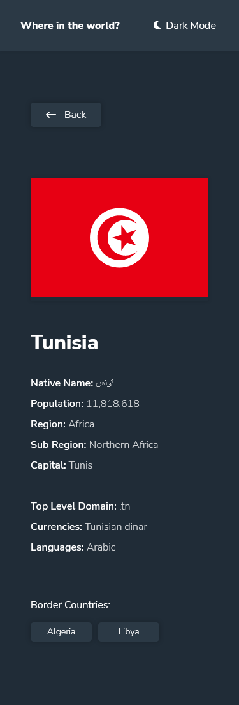
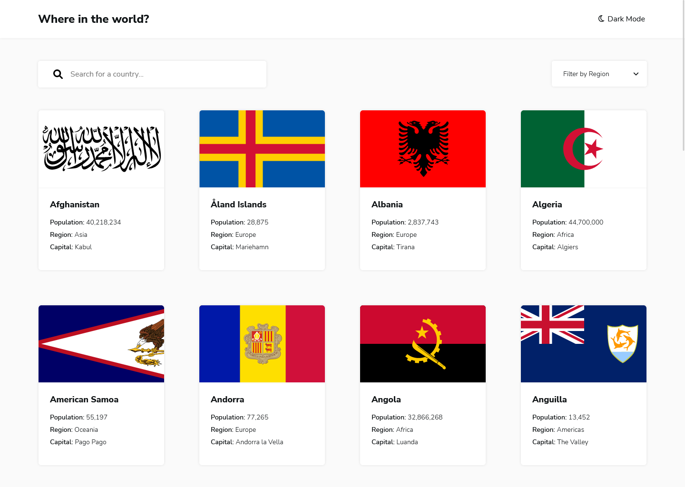

# Frontend Mentor - REST Countries API with color theme switcher solution

This is a solution to the [REST Countries API with color theme switcher challenge on Frontend Mentor](https://www.frontendmentor.io/challenges/rest-countries-api-with-color-theme-switcher-5cacc469fec04111f7b848ca). Frontend Mentor challenges help you improve your coding skills by building realistic projects.

## Table of contents

- [Overview](#overview)

  - [The challenge](#the-challenge)
  - [Screenshot](#screenshot)
  - [Links](#links)

- [My process](#my-process)
  - [Built with](#built-with)

## Overview

### The challenge

Users should be able to:

- See all countries from the API on the homepage
- Search for a country using an `input` field
- Filter countries by region
- Click on a country to see more detailed information on a separate page
- Click through to the border countries on the detail page
- Toggle the color scheme between light and dark mode _(optional)_

## Screenshot

### Mobile Solution (375px width)

### Desktop Solution (1440px width)

### Links

- [Solution URL](https://github.com/AchrefFast/Frontend-Mentor---REST-Countries-API-with-color-theme-switcher)
- [Live Site URL](https://frontend-mentor-rest-countries-api-with-color-theme-switcher-xi.vercel.app/)

## My process

### Built with

- Semantic HTML5 markup

- SASS

- CSS Grid
- CSS Flexbox

- Javascript

- React

- React Router

- Animation @keyframes

## Author

- Frontend Mentor - [@AchrefFast](https://www.frontendmentor.io/profile/AchrefFast)
- GitHub - [@AchrefFast](https://github.com/AchrefFast)
